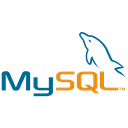
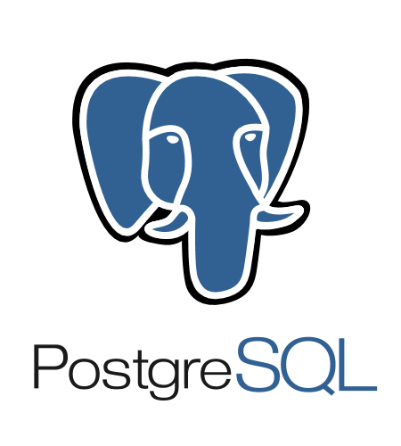

# TDBx 
:mount_fuji: **TDBx** is a tool for database manipulation written in Pascal with focus on abstraction of complex components configurations, simple call-to-action methods and no UI instances dependency. This is a multipurpose tool and can be used both in CLI and GUI apps. **TDBx** is hard coded by using [Firedac library](http://docwiki.embarcadero.com/RADStudio/Tokyo/en/FireDAC).


## Current Supported Databases
<p align='center'>
 


</p>

## Usage

First, you will need to download the file <a href="DBx.pas" download>DBx.pas</a>. Then, add on **Library Path** of your Delphi, by going at **Tools** > **Options** > **Environment Options** > **Delphi Options** > **Library** > *Library Path*.


## Avaliable Methods

### Database
-------------
#### `TDBx.startConnection(): TFDConnection;`
```pascal
{
  Connect to database
  You will use 'TDBX.startConnection' method, that will return
  an TFDConnection object
}

// Assign the parameters of the connection
with TDBX do
begin
  _DRIVER = 'mysql'|'PG'|'sqlite';
  _SERVER := 'localhost'|'127.0.0.1';
  _PORT := '3306';
  _USERNAME := 'evil_rick';
  _PASSWORD := 'dont_think_about_it';
  _DATABASE := 'morty';
  _TIMEOUT := '5000'; // milliseconds here
end;
  
// Try to connect
myCustomConnection := TDBx.startConnection;
```

#### `TDBX.killConnection(): boolean;`
```pascal
{
  Kill connection will interrupt the current connection
  by assign 'nil' to it, and returns 'true' if the connection
  has been closed successfully
}

if TDBx.killConnection() then
  // Connection closed ...
```

#### `TDBx.backupDatabase(const pDbName, pFileDestination: string);`
```pascal
{
  With 'TDBx.backupDatabase()' you can create a single backup file
  from your database
  
  Note: This method requires an extra configuration for each database.
  You can use the binary at your PATH env variable 
  or pass it manually before backup
}

{
  Backup in MySQL database requires 'mysqldump'.
}
 
// Using 'mysqldump' in PATH
TDBx.Mysql.MYSQLDUMP := '';
TDBx.backupDatabase('HV2233', 'C:\backups\HV2233_backup.sql');

// Using custom 'mysqldump'
TDBX.Mysql.MYSQLDUMP := 'C:\mysql\bin\mysqldump.exe';
TDBx.backupDatabase('HV2233', 'C:\backups\HV2233_backup.sql');

{
  Backup in Postgres database requires 'pg_dump'.
}
 
// Using 'pg_dump' in PATH
TDBx.Postgres.PG_DUMP := '';
TDBx.backupDatabase('HV2233', 'C:\backups\HV2233_backup.sql');

// Using custom 'pg_dump'
TDBX.Postgres.PG_DUMP := 'C:\psql\bin\pg_dump.exe';
TDBx.backupDatabase('HV2233', 'C:\backups\HV2233_backup.sql');
  
{
  Backup in SQLite database requires only the 'sqlite3' default binary.
}
 
// Using 'sqlite3' in PATH
TDBx.SQLite3.SQLite3 := '';
TDBx.backupDatabase('HV2233', 'C:\backups\HV2233_backup.sql');

// Using custom 'sqlite3'
TDBX.SQLite3.SQLite3 := 'C:\sqlite3\sqlite3.exe';
TDBx.backupDatabase('HV2233', 'C:\backups\HV2233_backup.sql');
```

### Another useful methods
- **`TDBx.createDatabase(const pDbName: string);`**
- **`TDBx.databaseExists(const pDbName: string): boolean;`**
- **`TDBx.dropDatabase(const pDbName: string);`**

### SQL
--------
#### `TDBX.execute(pSql: string): TFDQuery`
#### `TDBX.execute(pSql: string; pParams: array of variant): TFDQuery`
```pascal
{
  You can run your custom SQL command by using 'TDBx.execute()' method,
  which will return an 'TFDQuery' object if any data has been find
  or 'nil' if none.
}

// Select
qry := TDBx.execute('select * from user');
if qry <> nil then
  // At least one row was found
else
  // Table is empty
  
// select with pontual params

qry := TDBx.execute('select * from user where username = ? or email = ?',
                   ['simple_rick', 'i.am.simple@ricksanchez.io']);
if qry <> nil 
  // Rick Sanchez exists in user table
else
  // Rick not found
  
// Insert
TDBX.execute('insert into users(username, email, password, is_staff) values(?, ?, ?, ?)',
            ['sanchez_morty', 'mort7@rkc.me', 1588475, True]);
```

### Tables
-----------
#### `TDBx.createTable(const pTableName: string; const pColumns: array of string);`
```pascal
{
  'TDBX.createTable()' allow you to run create table command 
  with positional params for columns and attributes
}
  
TDBx.createTable('customer', 
                ['id int primary key auto_increment',
                 'created timestamp default current_timestamp', 
                 'name varchar(255)']);
```
--------------------------------------------------------------------------------------------------------
**Note:** Some pre-defined constants can be used in `TDBX.createTable` method, to avoid code repetition:

- **TDBx.Mysql.ID** = `'id int primary key auto_increment'`
- **TDBx.Mysql.CREATED** = `'created timestamp default current_timestamp'`
```pascal
TDBx.createTable('customer', 
                [TDBx.Mysql.ID,
                TDBx.Mysql.CREATED,
                'name varchar(255)']);
```

- **TDBx.Postgres.ID** = `'id int primary key auto_increment'`
- **TDBx.Postgres.CREATED** = `'created timestamp default now()'`
```pascal
TDBx.createTable('customer', 
                [TDBx.Postgres.ID,
                TDBx.Postgres.CREATED,
                'name varchar(255)']);
```
- **TDBx.SQLite3.ID** = `'ID INTEGER PRIMARY KEY AUTOINCREMENT'`
- **TDBx.SQLite3.CREATED** = `'created timestamp default current_timestamp'`
--------------------------------------------------------------------------------------------------------

### Another useful methods
- **`TDBx.tableExists(const pTableName: string): boolean;`**
- **`TDBx.dropTable(const pTableName: string);`**
- **`TDBx.clearTable(const pTableName: string);`**
- **`TDBx.renameTable(const pFromTable, pToTable: string);`**

### Columns
------------
#### `TDBx.columnExists(const pTableName, pColumnName: string): boolean;`
```pascal
{
  A simple check if some column exists in table
}
  if TDBx.columnExists('comment', 'liked') then
    // Do something
```


## License
[MIT](https://github.com/abekroenem/TFaker/blob/master/LICENSE)
